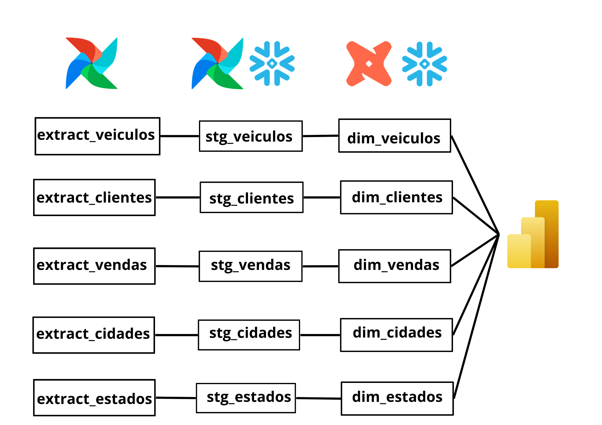
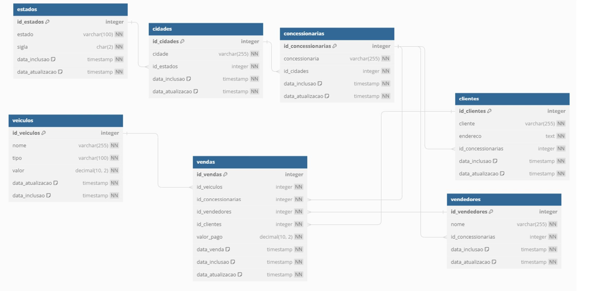

# NovaDrive Analytics

Pipeline de engenharia de dados completo para análise de vendas de concessionárias, utilizando tecnologias modernas de dados.

---

## Dashboard


---

## Arquitetura ELT




```
PostgreSQL → Apache Airflow → Snowflake (Stage) → dbt → Snowflake (Analytic) → Power BI
```

O pipeline segue o fluxo:

1. **Extração**: o Airflow extrai os dados brutos do PostgreSQL via carga incremental
2. **Load**: os dados são carregados no Snowflake no schema Stage (`stg_*`)
3. **Transformação**: o dbt transforma os dados do Stage em modelos analíticos dentro do próprio Snowflake
4. **Visualização**: o Power BI consome os modelos prontos e gera o dashboard

---

## Tecnologias

| Tecnologia | Versão | Função |
|---|---|---|
| Apache Airflow | 2.x | Orquestração do pipeline |
| PostgreSQL | 15 | Banco de dados fonte |
| Snowflake | - | Data Warehouse (Stage e Analytic) |
| dbt | 1.12.0 | Transformação dos dados |
| Power BI | - | Visualização e dashboard |
| Docker | - | Ambiente local do Airflow |
| Python | 3.14 | Linguagem base do pipeline |

---

## Estrutura do Projeto

```
novadrive-analytics/
├── README.md
├── airflow/
│   └── dags/
│       └── novadrive.py              # DAG de carga incremental Postgres → Snowflake
├── dbt/
│   └── novadrive/
│       ├── dbt_project.yml
│       └── models/
│           ├── stage/                # Modelos de staging (dados brutos)
│           │   ├── stg_cidades.sql
│           │   ├── stg_clientes.sql
│           │   ├── stg_concessionarias.sql
│           │   ├── stg_estados.sql
│           │   ├── stg_veiculos.sql
│           │   ├── stg_vendas.sql
│           │   └── stg_vendedores.sql
│           └── dimensions/           # Modelos dimensionais e analíticos
│               ├── dim_cidades.sql
│               ├── dim_clientes.sql
│               ├── dim_concessionarias.sql
│               ├── dim_estados.sql
│               ├── dim_veiculos.sql
│               ├── dim_vendedores.sql
│               ├── fct_vendas.sql
│               └── analise_vendas_*.sql
├── dashboard/
│   └── novadrive_dashboard.pbix
└── docs/
    ├── arquitetura_elt.png
    └── dashboard_visao_geral.png
```

---

## Instalação e Configuração

### Pré-requisitos

- [Docker Desktop](https://www.docker.com/products/docker-desktop/)
- [Python 3.10+](https://www.python.org/downloads/)
- Conta no [Snowflake](https://www.snowflake.com/) (trial gratuito)
- [Power BI Desktop](https://powerbi.microsoft.com/)
- [dbt CLI](https://docs.getdbt.com/docs/core/installation-overview)

---

### 1. Configurando o Airflow com Docker

```bash
# Clone o repositório
git clone https://github.com/seu-usuario/novadrive-analytics.git
cd novadrive-analytics

# Crie as pastas necessárias
mkdir dags logs plugins config

# Crie o arquivo de variáveis de ambiente
echo "AIRFLOW_UID=50000" > .env
echo "AIRFLOW__CORE__LOAD_EXAMPLES=False" >> .env

# Inicialize o banco do Airflow
docker compose up airflow-init

# Suba os containers
docker compose up -d
```

Acesse o Airflow em: [http://localhost:8080](http://localhost:8080)
- Usuário: `airflow`
- Senha: `airflow`

---

### 2. Configurando as Conexões no Airflow

No painel do Airflow, vá em **Admin → Connections** e crie duas conexões:

**Conexão PostgreSQL:**
| Campo | Valor |
|---|---|
| ID da Conexão | `postgres` |
| Tipo | `postgres` |
| Host | `seu_host` |
| Login | `seu_usuario` |
| Senha | `sua_senha` |
| Porta | `5432` |
| Schema | `public` |

**Conexão Snowflake:**
| Campo | Valor |
|---|---|
| ID da Conexão | `snowflake` |
| Tipo | `snowflake` |
| Host | `account.snowflakecomputing.com` |
| Login | `seu_usuario` |
| Senha | `sua_senha` |
| Schema | `STAGE` |

Campos Extra JSON:
```json
{
    "account": "seu_account",
    "warehouse": "COMPUTE_WH",
    "database": "NOVADRIVE",
    "role": "ACCOUNTADMIN"
}
```

---

### 3. Configurando o dbt

```bash
# Instale o dbt com suporte ao Snowflake
pip install dbt-snowflake

# Acesse a pasta do projeto dbt
cd dbt/novadrive

# Teste a conexão
dbt debug

# Execute os modelos
dbt run

# Gere a documentação
dbt compile --write-catalog
```

---

### 4. Executando o Pipeline

1. Acesse o Airflow em [http://localhost:8080](http://localhost:8080)
2. Ative a DAG `postgres_to_snowflake`
3. Clique em **Acionar** para executar manualmente
4. Acompanhe a execução no painel

---

### 5. Conectando o Power BI ao Snowflake

1. Abra o Power BI Desktop
2. Clique em **Obter Dados → Snowflake**
3. Servidor: `account.snowflakecomputing.com`
4. Warehouse: `COMPUTE_WH`
5. Selecione as tabelas do schema `ANALYTIC`
6. Clique em **Carregar**

---

## Modelagem de Dados

### Tabelas Fonte (Stage)
Dados brutos carregados do PostgreSQL sem transformação, armazenados no Snowflake.

### Dimensões (DIM)
Tabelas dimensionais com dados tratados e padronizados pelo dbt.

### Fato (FCT)
Tabela fato central com todas as vendas realizadas.

### Análises (ANALISE)
Agregações prontas para consumo direto no dashboard:
- `ANALISE_VENDAS_TEMPORAL` — vendas por período
- `ANALISE_VENDAS_CONCESSIONARIAS` — vendas por concessionária
- `ANALISE_VENDAS_VEICULOS` — vendas por tipo de veículo
- `ANALISE_VENDAS_VENDEDOR` — vendas por vendedor

---

## Dashboard

O dashboard foi construído no Power BI com as seguintes páginas:

- **Visão Geral** — KPIs principais, evolução temporal e distribuição geográfica
- **Concessionárias** — análise por concessionária
- **Veículos** — análise por tipo de veículo

---

## Autor

**Rafael** — [GitHub](https://github.com/seu-usuario) · [LinkedIn](https://linkedin.com/in/seu-perfil)

---

## Licença

Este projeto está sob a licença MIT.
