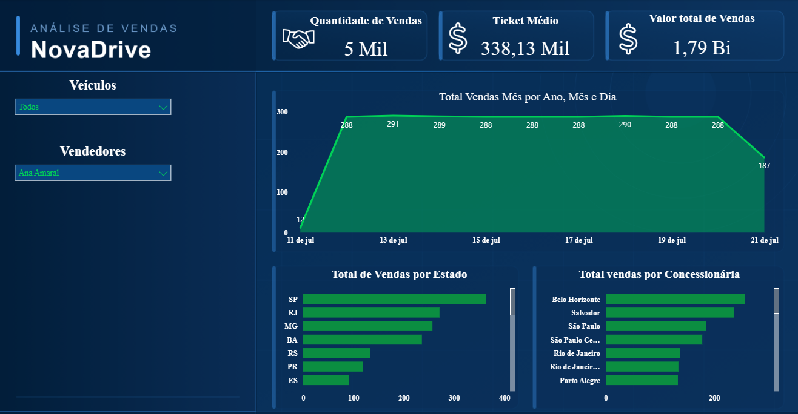
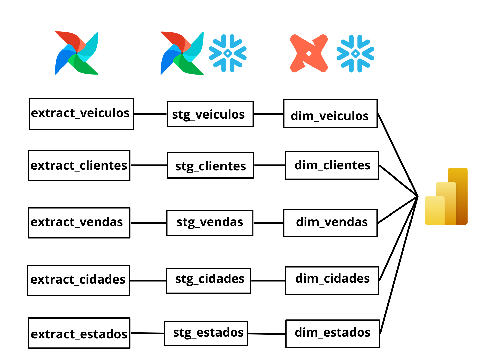
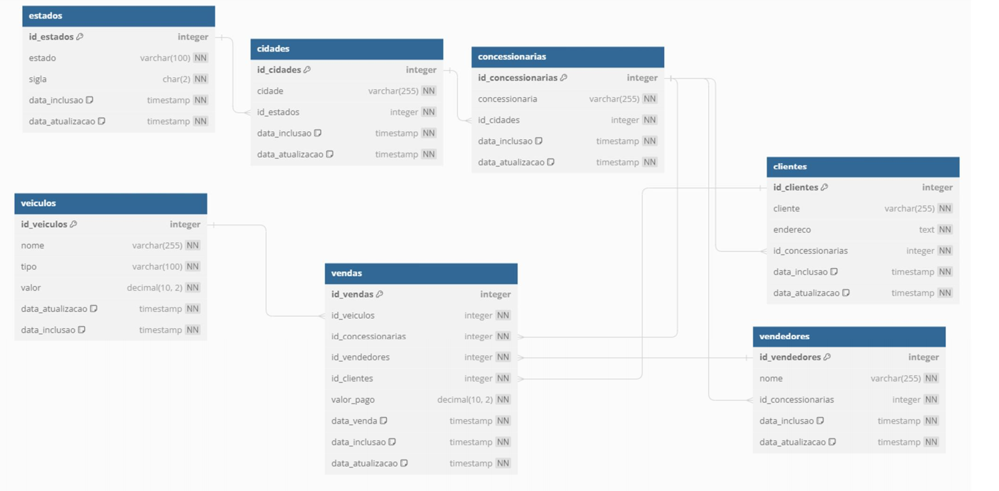

# NovaDrive Analytics

Pipeline de engenharia de dados completo para análise de vendas de concessionárias, cobrindo todo o ciclo ELT — da ingestão à visualização — com modelagem dimensional e testes automatizados de qualidade de dados.

---

## Dashboard



---

## Arquitetura ELT





```
PostgreSQL → Apache Airflow → Snowflake (Stage) → dbt → Snowflake (Analytic) → Power BI
```

O pipeline segue o fluxo:

1. **Extração**: o Airflow extrai os dados brutos do PostgreSQL via carga incremental
2. **Load**: os dados são carregados no Snowflake no schema Stage (`stg_*`)
3. **Transformação**: o dbt transforma os dados do Stage em modelos dimensionais e analíticos dentro do próprio Snowflake
4. **Qualidade**: testes automatizados no dbt validam unicidade, não-nulos e integridade referencial antes do consumo
5. **Visualização**: o Power BI consome os modelos prontos e gera o dashboard

---

## Destaques do projeto

- **Ciclo ELT completo e orquestrado**, com carga incremental do PostgreSQL para o Snowflake via Apache Airflow em Docker.
- **Modelagem dimensional (esquema estrela)**: tabela fato de vendas (`fct_vendas`) conectada a seis dimensões (clientes, veículos, vendedores, concessionárias, cidades e estados), mais views analíticas prontas para o dashboard.
- **~12 mil registros** ingeridos de sete fontes transacionais e transformados em camadas de staging e analítica.
- **26 testes de qualidade de dados no dbt**, cobrindo unicidade e não-nulos nas chaves primárias e integridade referencial entre a fato e as dimensões.
- **Carga incremental idempotente** com deduplicação por data de atualização mais recente, garantindo que reexecuções não gerem duplicidade.

---

## Qualidade de Dados

A qualidade dos dados é validada automaticamente pelo dbt a cada execução, com **26 testes** distribuídos entre a fato e as dimensões:

- **`unique`** e **`not_null`** nas chaves primárias de todas as dimensões e da tabela fato;
- **`relationships`** (integridade referencial) garantindo que toda venda referencie clientes, veículos, vendedores e concessionárias existentes, e que cidades e estados estejam corretamente encadeados;
- **`not_null`** em campos críticos da fato, como `valor_venda`.

Durante o desenvolvimento, esses testes detectaram **duplicações na origem** dos dados de clientes e vendas — cada registro chegava em duas versões (inclusão e atualização), o que inflava silenciosamente a tabela fato através dos *joins*. A correção foi aplicada deduplicando os modelos pela data de atualização mais recente:

```sql
QUALIFY ROW_NUMBER() OVER (
    PARTITION BY id_vendas
    ORDER BY data_atualizacao DESC
) = 1
```

Como a tabela fato é incremental, a reconstrução exigiu um `--full-refresh` para limpar o histórico já materializado. Após a correção, os **26 testes passam com sucesso**.

Para executar os testes:

```bash
dbt test
```

---

## Tecnologias

| Tecnologia | Função |
|---|---|
| Apache Airflow | Orquestração do pipeline |
| PostgreSQL | Banco de dados fonte (transacional) |
| Snowflake | Data Warehouse (schemas Stage e Analytic) |
| dbt | Transformação e testes de qualidade |
| Power BI | Visualização e dashboard |
| Docker | Ambiente local do Airflow |
| Python | Linguagem base do pipeline |

---

## Estrutura do Projeto

```
novadrive-analytics/
├── README.md
├── airflow/
│   └── dags/
│       └── novadrive.py              # DAG de carga incremental Postgres → Snowflake
├── dbt/
│   └── novadrive/
│       ├── dbt_project.yml
│       ├── source.yml                # Definição das fontes (schema STAGE)
│       └── models/
│           ├── stage/                # Views de staging (dados brutos)
│           │   ├── stg_cidades.sql
│           │   ├── stg_clientes.sql
│           │   ├── stg_concessionarias.sql
│           │   ├── stg_estados.sql
│           │   ├── stg_veiculos.sql
│           │   ├── stg_vendas.sql
│           │   └── stg_vendedores.sql
│           ├── dimensions/           # Tabelas dimensionais (DIM)
│           │   ├── dim_cidades.sql
│           │   ├── dim_clientes.sql
│           │   ├── dim_concessionarias.sql
│           │   ├── dim_estados.sql
│           │   ├── dim_veiculos.sql
│           │   └── dim_vendedores.sql
│           ├── facts/                # Tabela fato (FCT)
│           │   └── fct_vendas.sql
│           ├── analysis/             # Views analíticas para o dashboard
│           │   ├── analise_vendas_temporal.sql
│           │   ├── analise_vendas_concessionaria.sql
│           │   ├── analise_vendas_veiculos.sql
│           │   └── analise_vendas_vendedor.sql
│           └── schema.yml            # Testes de qualidade (unique, not_null, relationships)
├── dashboard/
│   └── novadrive_dashboard.pbix
└── docs/
    ├── diagrama_novadrive.png
    └── dashboard_visao_geral.png
```

---

## Instalação e Configuração

### Pré-requisitos

- [Docker Desktop](https://www.docker.com/products/docker-desktop/)
- [Python 3.10+](https://www.python.org/downloads/)
- Conta no [Snowflake](https://www.snowflake.com/) (trial gratuito)
- [Power BI Desktop](https://powerbi.microsoft.com/)
- [dbt CLI](https://docs.getdbt.com/docs/core/installation-overview)

---

### 1. Configurando o Airflow com Docker

```bash
# Clone o repositório
git clone https://github.com/Rafaelmjmj/novadrive-analytics.git
cd novadrive-analytics

# Crie as pastas necessárias
mkdir dags logs plugins config

# Crie o arquivo de variáveis de ambiente
echo "AIRFLOW_UID=50000" > .env
echo "AIRFLOW__CORE__LOAD_EXAMPLES=False" >> .env

# Inicialize o banco do Airflow
docker compose up airflow-init

# Suba os containers
docker compose up -d
```

Acesse o Airflow em: [http://localhost:8080](http://localhost:8080)
- Usuário: `airflow`
- Senha: `airflow`

---

### 2. Configurando as Conexões no Airflow

No painel do Airflow, vá em **Admin → Connections** e crie duas conexões:

**Conexão PostgreSQL:**
| Campo | Valor |
|---|---|
| ID da Conexão | `postgres` |
| Tipo | `postgres` |
| Host | `seu_host` |
| Login | `seu_usuario` |
| Senha | `sua_senha` |
| Porta | `5432` |
| Schema | `public` |

**Conexão Snowflake:**
| Campo | Valor |
|---|---|
| ID da Conexão | `snowflake` |
| Tipo | `snowflake` |
| Host | `account.snowflakecomputing.com` |
| Login | `seu_usuario` |
| Senha | `sua_senha` |
| Schema | `STAGE` |

Campos Extra JSON:
```json
{
    "account": "seu_account",
    "warehouse": "COMPUTE_WH",
    "database": "NOVADRIVE",
    "role": "ACCOUNTADMIN"
}
```

---

### 3. Configurando o dbt

```bash
# Instale o dbt com suporte ao Snowflake
pip install dbt-snowflake

# Acesse a pasta do projeto dbt
cd dbt/novadrive

# Teste a conexão
dbt debug

# Execute os modelos
dbt run

# Rode os testes de qualidade
dbt test
```

---

### 4. Executando o Pipeline

1. Acesse o Airflow em [http://localhost:8080](http://localhost:8080)
2. Ative a DAG `postgres_to_snowflake`
3. Clique em **Acionar** para executar manualmente
4. Acompanhe a execução no painel

---

### 5. Conectando o Power BI ao Snowflake

1. Abra o Power BI Desktop
2. Clique em **Obter Dados → Snowflake**
3. Servidor: `account.snowflakecomputing.com`
4. Warehouse: `COMPUTE_WH`
5. Selecione as tabelas do schema `ANALYTIC`
6. Clique em **Carregar**

---

## Modelagem de Dados

O modelo segue um **esquema estrela**, com a tabela fato de vendas no centro e as dimensões ao redor.

### Tabelas Fonte (Stage)
Views de staging com os dados brutos carregados do PostgreSQL, sem transformação de negócio.

### Dimensões (DIM)
Tabelas dimensionais tratadas, padronizadas e deduplicadas pelo dbt:
`dim_clientes`, `dim_veiculos`, `dim_vendedores`, `dim_concessionarias`, `dim_cidades` e `dim_estados`.

### Fato (FCT)
`fct_vendas` — tabela fato central com todas as vendas, construída via carga incremental e conectada às dimensões por chaves estrangeiras validadas por testes de integridade.

### Análises (ANALISE)
Views de agregação prontas para consumo direto no dashboard:
- `ANALISE_VENDAS_TEMPORAL` — vendas por período
- `ANALISE_VENDAS_CONCESSIONARIA` — vendas por concessionária
- `ANALISE_VENDAS_VEICULOS` — vendas por tipo de veículo
- `ANALISE_VENDAS_VENDEDOR` — vendas por vendedor

---

## Dashboard

O dashboard foi construído no Power BI com as seguintes páginas:

- **Visão Geral** — KPIs principais, evolução temporal e distribuição geográfica
- **Concessionárias** — análise por concessionária
- **Veículos** — análise por tipo de veículo

---

## Autor

**Rafael Machado Jeziorny** — [GitHub](https://github.com/Rafaelmjmj) · [LinkedIn](https://www.linkedin.com/in/rafael-machado-62332b239/)

---

## Licença

Este projeto está sob a licença MIT.
